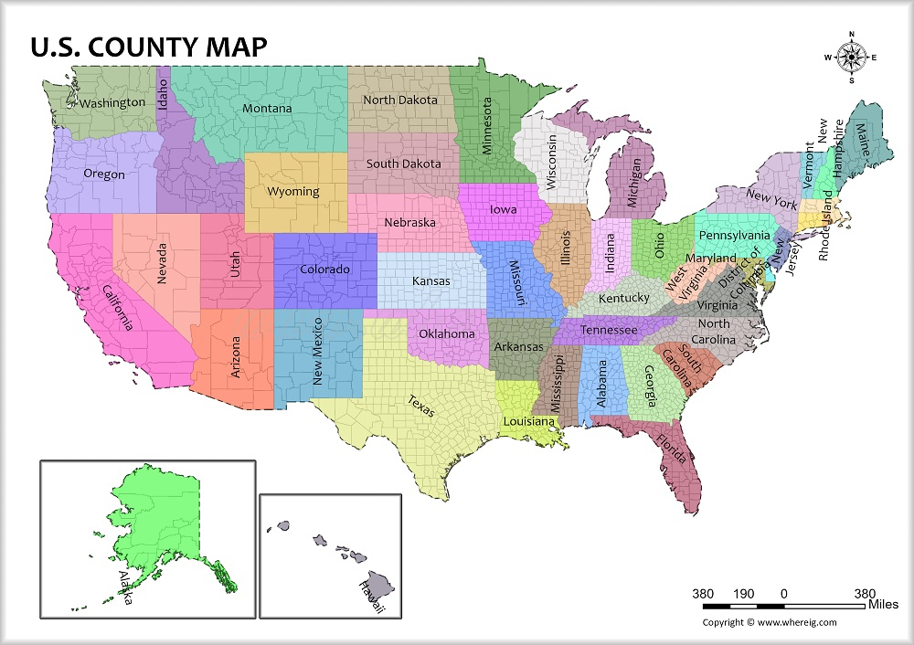
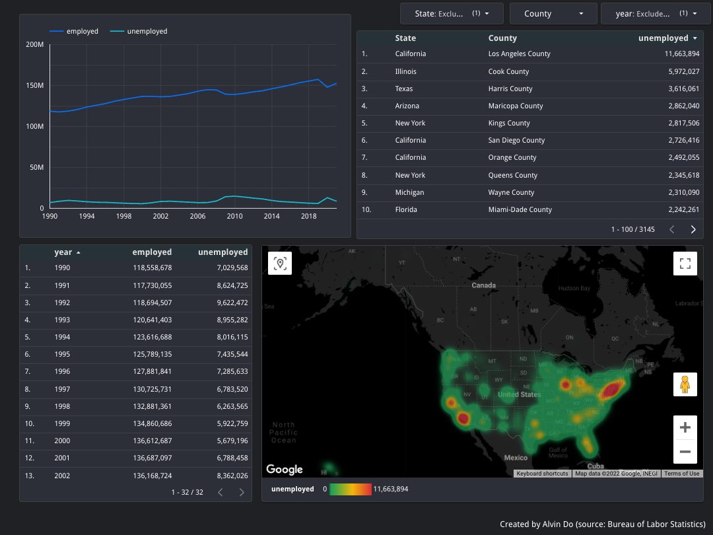

# 🇺🇸  Employment/Unemployment Data in the US since 1990

# Data Engineering Zoomcamp Final Capstone Project
🟢 This capstone project was taught by [DataTalksClub](https://datatalks.club/). A big thank you to instructors [Alexey Grigorev](https://www.linkedin.com/in/agrigorev/), [Sejal Vaidya](https://www.linkedin.com/in/vaidyasejal/), [Victoria Perez Mola](https://www.linkedin.com/in/victoriaperezmola/), and [Ankush Khanna](https://www.linkedin.com/in/ankushkhanna2/) for their time and effort leading this course!

🟢 You can learn Data Engineering topics on your own time [here](https://github.com/DataTalksClub/data-engineering-zoomcamp) and follow along with the [video lectures](https://www.youtube.com/playlist?list=PL3MmuxUbc_hJed7dXYoJw8DoCuVHhGEQb) on YouTube!

# Problem Description
The goal of this project is to track historical US employment data (1990-Present). The source of the datasets I've used were from the Bureau Labor of Statistics (source: [BLS](https://www.bls.gov/lau/)). This dataset includes data down to each counties in each state in the US to view things more precisely residentially.

# Used Technologies
For this project, I used the following tools:
* Google Cloud Platform (GCP) - main cloud provider
* Google Cloud Storage (GCS) - data lake storage under GCP
* BigQuery - data warehouse storage under GCP
* Python - main programming language
* Docker - containerization (docker-compose)
* Airflow - orchestration tool for pipeline
* Terraform - Infrastructure-as-Code (IaC) tool
* Spark - data processing and transformations
* Google Data Studio - data visualizations

# Reproducing from scratch
## 1. To reproduce this code entirely from scratch, you will need to create a GCP account:
Set up your free GCP account! You'll get free $300 credit or 90 days of free usage.
* Set up your  very own [service account](https://cloud.google.com/)
* Create key in JSON
* Save to your directory
* download and install [Google Cloud CLI](https://cloud.google.com/sdk/docs/install)
* run `export GOOGLE_APPLICATION_CREDENTIALS=<path/to/service/key>.json`
* run `gcloud auth application-default login`
* new browser window will pop up having you authenticate the gcloud CLI. Make sure it says `You are now authenticated with the gcloud CLI!`

## Next for GCP: Add permissions to your Service Account!
* IAM & Admin > IAM. Click on the edit icon for your project
* Add roles
    * Storage Admin (for the bucket)
    * Storage Object Admin (for objects in the bucket -- read/write/create/delete)
    * BigQuery Admin
* Enable APIs
    * https://console.cloud.google.com/apis/library/iam.googleapis.com
    * https://console.cloud.google.com/apis/library/iamcredentials.googleapis.com

## 2. You'll need your IaC to build your infrastructure. In this project, Terraform is used
Download Terraform!
* Download here: https://www.terraform.io/downloads

Initializing Terraform
* Create a new directory with `main.tf`, and initialize your config file. [How to Start](https://learn.hashicorp.com/tutorials/terraform/google-cloud-platform-build?in=terraform/gcp-get-started)
    * *OPTIONAL* Create `variables.tf` files to store your variables
* `terraform init`
* `terraform plan`
* `terraform apply`

## 3. Set up Docker, Dockerfile, and docker-compose to run Airflow
Steps to do that is provided [here](https://github.com/DataTalksClub/data-engineering-zoomcamp/tree/main/week_2_data_ingestion/airflow).

## 4. Run the DAGs
In the screenshot below:
* run the `data_ingestion_gcp_dag` first and wait for it to complete. 
* Finally, run `gcs_to_bq_dag`.

## 5. Create your dashboard
* Go to [Google Data Studio](https://datastudio.google.com) 
* Click `Create` > `Data Source`
* Select `BigQuery` > Your Project ID > Dataset > Table
* Click on `Connect` on the top-right and your data should now be imported to use for your dashboard!

Below is a screenshot of my [dashboard](https://datastudio.google.com/reporting/086e2c44-85a5-4ce8-b8ee-98be102a0b6c).

* **NOTE**: To speed up the process of the dashboard, on the dropdowns on the top-right, **UNCHECK** the blanks in `State` and `year`. (I'll have to fix that!)

Thank you again to everyone for their dedication and support! If you have any questions, please feel free to open a PR or send me an email. Bless!